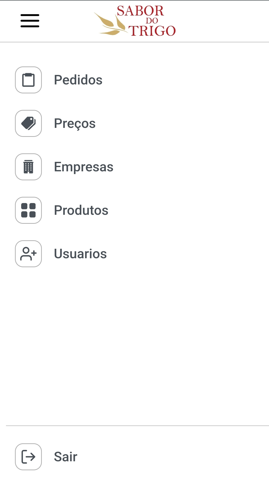

    

##

    
    
    

 

## 💻 Projeto

Esse é um projeto completo de um gerenciador de pedidos da padaria Sabor do Trigo, em Recife/PE. É um projeto Full-stack com repositórios Front-end e Back-end, os deploys das duas aplicações foram feitas usando o [Railway](https://railway.app) e o [Vercel](https://vercel.com)

## 🌌 Tecnologias

Esse projeto foi desenvolvido com as seguintes tecnologias:

### **<a href="https://github.com/egfs1/padaria-pedidos-backend">Back-end</a>**

- [Node.js](https://nodejs.org/en/)
- [Typescript](https://www.typescriptlang.org/)
- [Prisma](https://prisma.io/)
- [Express](https://expressjs.com/pt-br/)
- [JWT](https://www.npmjs.com/package/jsonwebtoken)

### **<a href="https://github.com/egfs1/padaria-pedidos-frontend">Front-end</a>**
- [Node.js](https://nodejs.org/en/)
- [Typescript](https://www.typescriptlang.org/)
- [React](https://reactjs.org)
- [Bootstrap](https://getbootstrap.com/)
- [SASS](https://sass-lang.com/)
